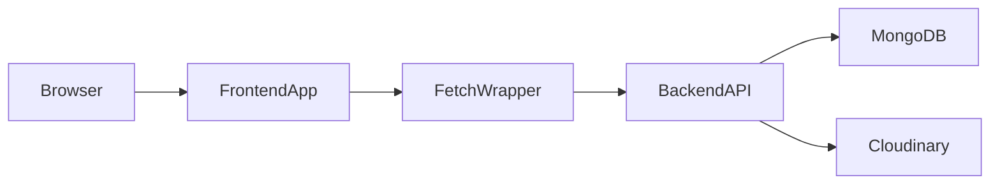

# Frontend ↔ Backend Integration (Technical Guide)

This document explains **how the React (Vite) frontend integrates with the Express backend** in this project, including **why Axios is not required**, how **auth works with httpOnly cookies**, how **product image uploads work with Cloudinary**, and what to watch for in **production**.

> Scope: practical + detailed. It avoids dumping full code; instead it explains the moving parts and where to find them.

---

## 1) Architecture overview

### Components
- **Frontend**: Vite + React (`frontend/`)
- **Backend**: Express API (`backend/`)
- **Database**: MongoDB (Mongoose)
- **Media storage**: Cloudinary (product images)

### High-level request routing
- The frontend calls the backend via HTTP:
  - `GET/POST/PATCH/DELETE /api/...`
- In development, Vite proxies `/api` to the backend to avoid CORS friction.

---

## 2) How the frontend calls the backend (without Axios)

### The core design
Instead of Axios, the project uses **native `fetch`** wrapped by a single helper module:
- `frontend/src/utils/api.js`

This wrapper centralizes:
- **Base URL**: `VITE_API_URL`
- **Cookies**: `credentials: 'include'` (required for httpOnly cookie auth)
- **Content-Type rules**:
  - JSON requests get `Content-Type: application/json`
  - `FormData` requests do **not** set `Content-Type` manually (browser must set boundary)
- **Error handling**: normalizes backend error payloads into a thrown JS `Error`
- **Refresh retry**: if a request returns `401`, it attempts `POST /api/auth/refresh-token` once, then retries the original request

### Why not Axios?
Axios would be fine, but it’s not required here because:
- **Modern browsers already support `fetch`** well.
- The project already implemented an **Axios-like “interceptor” pattern** in `apiFetch()` (refresh retry, shared headers, consistent errors).
- Avoids an extra dependency and keeps the API layer explicit and small.

### What to say if asked in an interview
“I used `fetch` with a centralized wrapper so every API call is consistent. It includes cookie support, error normalization, refresh-token retry logic, and proper handling of `FormData` uploads—so Axios wasn’t necessary.”

---

## 3) Authentication: httpOnly cookies + refresh flow

### Tokens and storage
The backend uses:
- **Access token** (short lived)
- **Refresh token** (longer lived)

Tokens are stored in **httpOnly cookies** (not accessible to JavaScript), so the frontend authenticates by sending cookies automatically.

Relevant backend files:
- Cookie issuing: `backend/utils/tokenUtils.js` (`setAuthCookies`)
- Login/refresh endpoints: `backend/controllers/authController.js`, `backend/routes/authRoutes.js`
- Frontend retry logic: `frontend/src/utils/api.js`

### Cookie behavior (important for production)
Cookies are configured roughly like:
- `httpOnly: true` (protects against XSS reading tokens)
- `secure: NODE_ENV === 'production'` (cookies only sent over HTTPS in prod)
- `sameSite: 'strict'` (very restrictive; best security, but affects cross-site hosting)

**Implication:** In production, if your frontend and backend are on totally different “sites” (different eTLD+1), `sameSite: 'strict'` can prevent cookies from being sent, causing login/refresh to fail.

Recommended hosting topology for this cookie setup:
- `https://app.example.com` (frontend)
- `https://api.example.com` (backend)

This is typically still **same-site** and works well with strict cookies.

### Refresh flow (what happens on 401)
1. Frontend calls an API endpoint with `credentials: 'include'`.
2. If backend returns `401` (access token expired), frontend calls:
   - `POST /api/auth/refresh-token`
3. If refresh succeeds, the frontend retries the original request once.

This pattern is implemented in `frontend/src/utils/api.js` so your components/hooks don’t need to handle token refresh manually.

---

## 4) CORS + dev proxy (why local dev is easy)

### Backend CORS settings
The backend enables CORS with:
- `origin: process.env.FRONTEND_URL`
- `credentials: true`

Meaning:
- Only the configured frontend origin is allowed.
- Cookies are allowed to be sent/received.

### Vite proxy in development
In dev, Vite proxies:
- `/api/*` → backend
- `/uploads/*` → backend (legacy)

So you can call `/api/products` from the frontend without manually typing the backend host.

---

## 5) Admin products: create/update flow (including image upload)

### Frontend side (admin UI)
The admin UI edits products using:
- A modal that stores image changes as a `data:image/...` URL (base64) after selecting a file.
- A hook that converts product data to `FormData` for create/update.

Key idea:
- If the image is base64 (`data:image...`), it’s converted to a `Blob` and appended to `FormData` under the field name **`image`**.
- Requests are sent as `multipart/form-data` by the browser (the wrapper intentionally does not set `Content-Type`).

Result:
- Backend receives a real file upload in `req.file` (via multer).

### Backend side: route → middleware → controller → service → DB
Create route chain (simplified):
1. `POST /api/products/create`
2. `productUploadBundle` (multer + validate + process + Cloudinary upload)
3. `requireImage` (enforce image required for create)
4. `createProduct` controller → `ProductService.createProduct`

Update route chain (simplified):
1. `PATCH /api/products/:productId`
2. `productUploadBundle` (image optional)
3. `updateProduct` controller → `ProductService.updateProduct`

---

## 6) Image pipeline: from browser to Cloudinary

### What happens now (Cloudinary-first)
1. **Browser** uploads multipart `image` field.
2. **Multer** stores the file in memory (no disk write).
3. **Validation** checks the real file signature from the in-memory buffer.
4. **Sharp** resizes/re-encodes to consistent dimensions/format (buffer output).
5. **Cloudinary** upload_stream uploads the processed buffer.
6. Backend stores:
   - `Product.image` = Cloudinary `secure_url` (string)
   - `Product.imagePublicId` = Cloudinary `public_id`

Why store `imagePublicId`?
- So updates/deletes can remove old Cloudinary assets and avoid orphaned files + storage usage.

### Why the frontend didn’t need big changes
Admin product image rendering already supports:
- Absolute URLs (`https://...`) → display directly
- Legacy relative paths (`uploads/...`) → prefix with backend base URL

So switching `Product.image` to a Cloudinary URL doesn’t break admin pages.

---

## 7) One-time migration: local uploads → Cloudinary

Purpose:
- Existing products may still have `image = "uploads/products/..."`.
- The migration script uploads those local files to Cloudinary and updates MongoDB to the new URL + `imagePublicId`.

How it works:
- Query: find products where `image` starts with `uploads/products/`
- For each product:
  - read the local file from `backend/uploads/...`
  - upload to Cloudinary using a deterministic publicId: `product_<mongoId>`
  - update Mongo:
    - `image = secure_url`
    - `imagePublicId = public_id`
  - optional: delete the local file after DB update

Why deterministic publicId matters:
- If the script is re-run, `overwrite: true` updates the same Cloudinary asset instead of creating duplicates.

---

## 8) Disabling local image serving (Cloudinary-only mode)

The backend only serves `/uploads` when:
- `SERVE_LOCAL_UPLOADS=true`

After migration, set:
- `SERVE_LOCAL_UPLOADS=false`

**Important:** if you disable `/uploads` before migrating all products, any product still pointing to `uploads/products/...` will show broken images.

---

## 9) Production checklist (practical)

### Required env vars (backend)
- `NODE_ENV=production` (cookie security + prod behavior)
- `MONGODB_URI=...`
- `FRONTEND_URL=https://<your-frontend-domain>`
- Cloudinary:
  - `CLOUDINARY_CLOUD_NAME`
  - `CLOUDINARY_API_KEY`
  - `CLOUDINARY_API_SECRET`
- `SERVE_LOCAL_UPLOADS=false`
- JWT secrets (admin/customer + refresh)

### Required env vars (frontend)
- `VITE_API_URL=https://<your-backend-domain>`

### Hosting note (cookie + CORS)
Because cookies are `sameSite: 'strict'`, prefer hosting frontend/backend on the **same site** (e.g. subdomains of the same domain).

---

## Summary (minimal)
- Frontend integrates via a centralized **`fetch` wrapper** (base URL, cookies, refresh retry, FormData support) instead of Axios.
- Auth uses **httpOnly cookies**; production works best when frontend/backend share the same “site”.
- Images are processed in-memory and uploaded to **Cloudinary**; Mongo stores `image` URL + `imagePublicId`, with a one-time migration script for legacy local paths.

